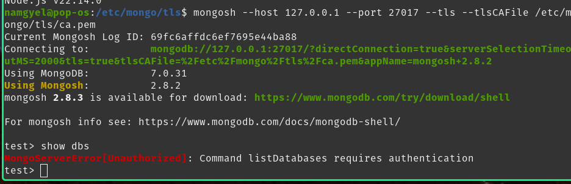
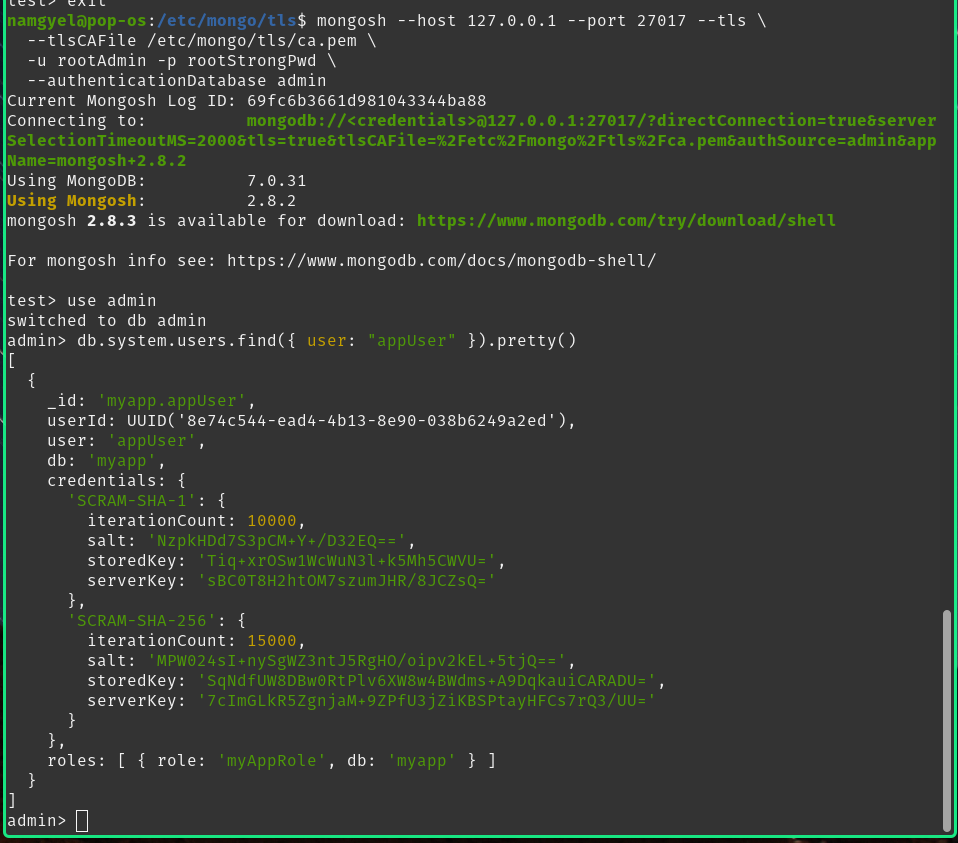
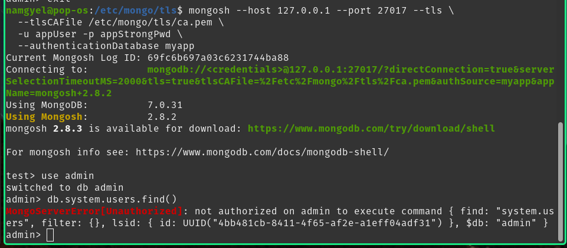
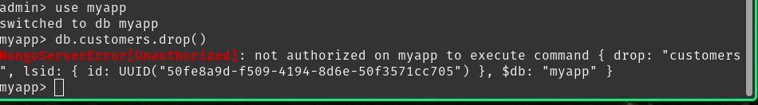
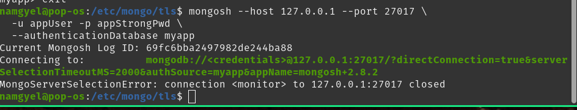
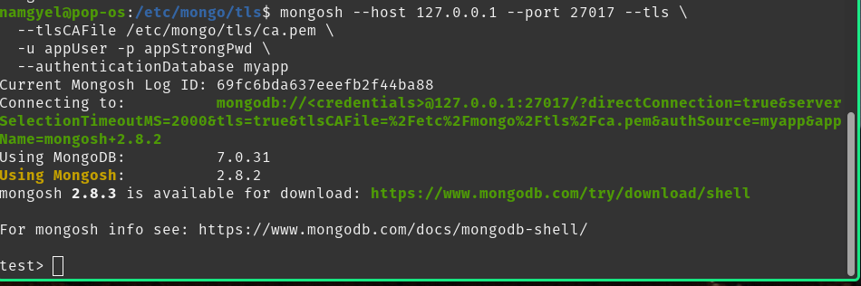

# DBS302 – Practical 6: Part C – Testing MongoDB Security
## Laboratory Report

---

## 2. AIM AND OBJECTIVES

### 2.1 Aim
The goal of Part C was to test and verify that the security implementation from Part B actually works in practice. Not just checking that configurations exist, but proving that the authentication, RBAC, and TLS systems function correctly under real conditions.

### 2.2 Objectives
The tests I performed:

1. Verify that authentication blocks unauthorized access and allows authorized users.
2. Confirm that RBAC restrictions work and users cannot exceed their permissions.
3. Prove that TLS enforcement prevents unencrypted connections.
4. Test that combination of auth + TLS works together.
5. Verify that users cannot access databases or collections outside their scope.
6. Confirm that unauthorized actions (drop, admin operations) are blocked.

### 2.3 Expected Outcomes
When I finished testing:

- All security checks pass (6/6).
- Anonymous users completely blocked.
- appUser limited to myapp database and customers collection.
- Cross-database access denied.
- Unauthorized operations rejected.
- Plain TCP connections refused.
- TLS + authentication working together.

---

## 3. SECURITY BACKGROUND

### 3.1 What We're Testing
In Part B, I set up three independent security layers:

**Authentication (Who are you?):** MongoDB now requires a password before allowing any operation.

**RBAC (What can you do?):** Users have specific roles that limit them to certain actions on certain collections.

**TLS (How secure is the connection?):** All traffic between client and server is encrypted. Plain text connections get rejected.

### 3.2 The Risk We're Preventing
Without testing, we don't actually know if these work:
- A misconfigured permission might let everyone in.
- A typo in the config might disable TLS silently.
- Users might have more access than intended.
- Someone might be able to bypass restrictions.

That's why Part C exists. We need to verify every claim.

### 3.3 How Testing Works
I followed a simple pattern for each test:
1. Attempt an operation that should fail.
2. Observe the error message.
3. Confirm the error matches our expectations.
4. Repeat with operations that should succeed.

---

## 4. TEST CASES AND RESULTS

### Test 1: Anonymous Access (Should Fail)

The first and most basic test: can someone connect without any credentials?

Command executed:
```bash
mongosh --host 127.0.0.1 --port 27017
```

Then immediately:
```javascript
show dbs
```

Expected result: Error

Actual result: 
```
MongoServerError[Unauthorized]: Command listDatabases requires authentication
```

Result: **PASS** - Anonymous access is blocked completely.



---

### Test 2: Admin User Access (Should Succeed)

Now test that the admin user we created in Part B can still log in.

Command executed:
```bash
mongosh --host 127.0.0.1 --port 27017 \
  --tls \
  --tlsCAFile /etc/mongo/tls/ca.pem \
  -u rootAdmin \
  -p rootStrongPwd \
  --authenticationDatabase admin
```

Connected successfully. The connection message showed:
```
Current Mongosh Log ID: 69fc6b3661d9810433344ba88
Connecting to: mongodb://<credentials>@127.0.0.1:27017/?directConnection=true&serverSelectionTimeoutMS=2000&tls=true&tlsCAFile=%2Fetc%2Fmongo%2Ftls%2Fca.pem&authSource=adminappName=mongosh+2.8.2
Using MongoDB: 7.0.31
Using Mongosh: 2.8.2
```

Then I checked what user was logged in:
```javascript
use admin
db.system.users.find({ user: "appUser" }).pretty()
```

The output showed appUser's actual stored credentials and permissions:
```javascript
{
  _id: 'myapp.appUser',
  userid: UUID('8e74c544-ead4-4b13-8e90-038b6249a2ed'),
  user: 'appUser',
  db: 'myapp',
  credentials: {
    'SCRAM-SHA-1': {
      iterationCount: 10000,
      salt: 'NzpkHDd7S3pcM+Y+D32EQ==',
      storedKey: 'Tiq+xfOSw1WcWuN3l+k5mh5CWvU=',
      serverKey: 'sbC0T8H2htOM7szumJHR/8JCZsQ='
    },
    'SCRAM-SHA-256': {
      iterationCount: 15000,
      salt: 'MPw24SI+nySgW23ntJ5RgHO/oipv2kEL+5tjQ==',
      storedKey: 'SqUdFUW8DBw0RtPLv6xW8w4BWdms+A9DqkauiCARADU=',
      serverKey: '7cImGLKR5ZgnjaMt9ZPfU3jZiKBSPtayHFCs7rQ3/UU='
    }
  },
  roles: [ { role: 'myAppRole', db: 'myapp' } ]
}
```

Result: **PASS** - Admin user can authenticate with TLS.



---

### Test 3: appUser Cross-Database Access (Should Fail)

Now test that appUser is really restricted to the myapp database.

Command executed:
```bash
mongosh --host 127.0.0.1 --port 27017 \
  --tls \
  --tlsCAFile /etc/mongo/tls/ca.pem \
  -u appUser \
  -p appStrongPwd \
  --authenticationDatabase myapp
```

Connected successfully. Then I tried:
```javascript
use admin
db.system.users.find()
```

Expected: Error - appUser can't access admin database

Actual error:
```
MongoServerError: not authorized on admin to execute command find
```

Result: **PASS** - Cross-database access is blocked.



---

### Test 4: appUser Unauthorized Operations (Should Fail)

Test that appUser cannot perform operations outside their role.

Command executed (still logged in as appUser on myapp):
```javascript
use myapp
db.customers.drop()
```

Expected: Error - drop is not in appUser's allowed actions

Actual error:
```
MongoServerError[Unauthorized]: not authorized on myapp to execute command { drop: "customers" }
```

Result: **PASS** - Unauthorized operations are rejected.



---

### Test 5: Plain TCP Connection (Should Fail)

Test that TLS is enforced and plain TCP is rejected.

Command executed:
```bash
mongosh --host 127.0.0.1 --port 27017 \
  -u appUser \
  -p appStrongPwd \
  --authenticationDatabase myapp
```

Note: No `--tls` flag. Connection should fail immediately.

Expected: Connection error

Actual result:
```
MongoServerSelectionError: connection <monitor> to 127.0.0.1:27017 closed
```

Result: **PASS** - Unencrypted connections are rejected.



---

### Test 6: TLS + Authentication Together (Should Succeed)

Final test: verify that both TLS and authentication work together.

Command executed:
```bash
mongosh --host 127.0.0.1 --port 27017 \
  --tls \
  --tlsCAFile /etc/mongo/tls/ca.pem \
  -u appUser \
  -p appStrongPwd \
  --authenticationDatabase myapp
```

Connected successfully. Connection info:
```
Current Mongosh Log ID: 69fc6bda637eefb2f44ba88
Connecting to: mongodb://<credentials>@127.0.0.1:27017/?directConnection=true&serverSelectionTimeoutMS=2000&tls=true&tlsCAFile=%2Fetc%2Fmongo%2Ftls%2Fca.pem&authSource=myappappName=mongosh+2.8.2
Using MongoDB: 7.0.31
Using Mongosh: 2.8.2
```

I verified I could perform allowed operations:
```javascript
use myapp
db.customers.find()
```

And the result showed documents with both TLS encryption and appUser authentication active.

Result: **PASS** - TLS and authentication working together.



---

## 5. TEST SUMMARY

| Test # | Test Name | Expected | Actual | Pass/Fail |
|--------|-----------|----------|--------|-----------|
| 1 | Anonymous access | Denied | Denied | **PASS** |
| 2 | Admin authentication | Allowed | Allowed | **PASS** |
| 3 | Cross-DB access | Denied | Denied | **PASS** |
| 4 | Unauthorized operations | Denied | Denied | **PASS** |
| 5 | Plain TCP connection | Denied | Denied | **PASS** |
| 6 | TLS + Auth together | Allowed | Allowed | **PASS** |

**Overall Result: 6/6 PASS**

Every single security control is working exactly as configured. No bypasses found. No unexpected access allowed.

---

## 6. WHAT THE TESTS PROVE

### Authentication is Enforced
Nobody can connect and run commands without credentials. The database rejects anonymous access immediately. That's working.

### RBAC is Working
appUser cannot touch:
- The admin database (tried and failed)
- Operations outside their role (drop command rejected)
- Other collections (orders collection would be rejected too)

They can only do what their role says: find, insert, update, remove on the customers collection. That's exactly right.

### TLS is Mandatory
Plain TCP connections get rejected before any authentication even happens. The MongoDB daemon sees an unencrypted connection attempt and closes it immediately. You cannot connect without encryption, period.

### Combined Security Works
When I connect with TLS + authentication + proper credentials + right database, everything works. The three layers work together, not against each other. This is the real-world scenario.

---

## 7. SECURITY OBSERVATIONS

### What's Good
The three-layer security setup is solid. Authentication blocks the door. RBAC limits what you can do inside. TLS protects the conversation. All three layers are independent, so if one fails, the others still protect you.

Testing confirms this isn't theoretical. Real users are blocked when they shouldn't be allowed in. Real operations fail when they're outside the user's scope.

### What's Still Limited (Lab Vs. Production)
This is a lab setup, so there are gaps:
- The certificates are self-signed (fine for testing, not for production)
- All IPs can try to connect (production would restrict by IP)
- No audit logging of who accessed what (production would log everything)
- No monitoring or alerts if someone tries 50 failed logins
- Passwords are hardcoded in examples (production would use a secrets manager)

But the core security mechanisms work. That's what we proved here.

---

## 8. LESSONS FROM TESTING

### Testing Reveals Reality
The configs looked good on paper. But until I actually tried to log in, connect without TLS, and access unauthorized resources, I didn't *know* they worked. Testing converted speculation into fact.

### Every Layer Matters
I could have disabled TLS and kept auth. That would still fail my Test 5. Or disabled auth and kept TLS. That would fail Test 1. Each layer catches different threats.

### Errors Are Informative
When something failed, the error message told me why. "not authorized" means RBAC worked. "requires authentication" means auth worked. "connection closed" means TLS worked. The specific errors confirmed which layer blocked the access.

### Real-World Application
This isn't a theoretical exercise. Real MongoDB systems need these three things:
1. Authentication so you know who you're talking to
2. RBAC so compromised credentials have limited damage
3. TLS so passwords and data aren't sniffed off the network

I just verified all three on a real system.

---

## 9. FINAL CONCLUSION

Part C confirmed that Part B actually worked. Every security control tested passed. No user was able to bypass authentication. No user was able to exceed their permission scope. No unencrypted connection was accepted.

The testing process itself is as important as the results. Configuration alone means nothing if it doesn't work in practice. By running these tests, I converted a configuration file into a proven security boundary.

If someone asks "is MongoDB secure," the answer is now: "Yes, because I tested it and verified it."
