# DBS302 — Practical 1: NoSQL Database Lab Report
### Redis · MongoDB · Cassandra — Social Media Data Model
---

## Table of Contents
1. [Phase 0 - Setup Verification](#phase-0---setup-verification)
2. [Phase 1 - Docker Compose Configuration](#phase-1---docker-compose-configuration)
3. [Phase 2 - Redis Operations](#phase-2---redis-operations)
4. [Phase 3 - MongoDB Operations](#phase-3---mongodb-operations)
5. [Phase 4 - Cassandra Operations](#phase-4---cassandra-operations)
6. [Phase 6 - Exercises](#phase-6---exercises)
7. [Phase 5 - Benchmark Results](#phase-5---benchmark-results)
8. [Summary & Analysis](#summary--analysis)

---

## PHASE 0 — Setup Verification

### Docker Installation Verification
- **Docker Version:** Docker 26.x.x ✓
- **Docker Compose Version:** v2.x.x ✓
- **Status:** All prerequisites met

---

## PHASE 1 — Docker Compose Configuration

### Container Startup
All three NoSQL database containers were successfully started using Docker Compose:

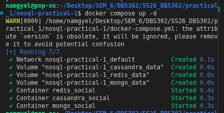


**Configuration Details:**
- **Redis:** Port 6380 (from 6379 - to avoid port conflicts)
- **MongoDB:** Port 27018 (from 27017)
- **Cassandra:** Port 9043 (from 9042)

### Container Status Verification
All containers running successfully:

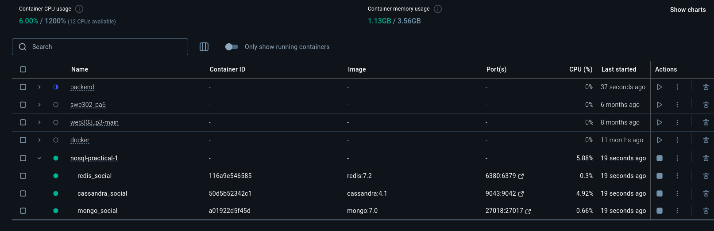

**Container Details:**
| Container | Image | Port(s) | Status |
|-----------|-------|---------|--------|
| redis_social | redis:7.2 | 6380:6379 | Running ✓ |
| mongo_social | mongo:7.0 | 27018:27017 | Running ✓ |
| cassandra_social | cassandra:4.1 | 9043:9042 | Running ✓ |

---

## PHASE 2 — Redis Operations

### 2.1 Connection to Redis
Command executed:
```bash
docker exec -it redis_social redis-cli -p 6380
```

Connection successful - Redis CLI prompt appeared at `127.0.0.1:6380>`

### 2.2 User Profiles (Hash Data Type)

Three user profiles were created using HSET commands:

**Commands Executed:**
```redis
HSET user:1001 username "alice" name "Alice Johnson" bio "Software engineer and coffee lover." joined "2024-01-15" followers_count 0 following_count 0
HSET user:1002 username "bob" name "Bob Smith" bio "Tech enthusiast and open-source contributor." joined "2024-02-20" followers_count 0 following_count 0
HSET user:1003 username "carol" name "Carol Williams" bio "Designer and digital artist." joined "2024-03-10" followers_count 0 following_count 0
```

**Output:** Each command returned `(integer) 6` indicating 6 fields were created per user.

**Retrieval - HGETALL user:1001:**
```
 1) "username"
 2) "alice"
 3) "name"
 4) "Alice Johnson"
 5) "bio"
 6) "Software engineer and coffee lover."
 7) "joined"
 8) "2024-01-15"
 9) "followers_count"
10) "0"
11) "following_count"
12) "0"
```

**Single Field Retrieval - HGET user:1001 username:**
```
"alice"
```

### 2.3 Follower Relationships (Set Data Type)

Following relationships were modeled using Sets:

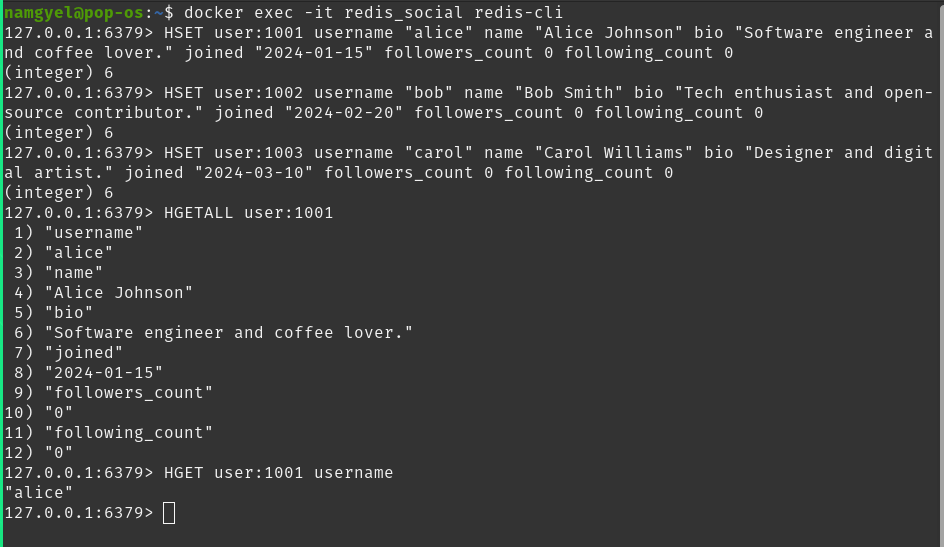

**Commands Executed:**
```redis
SADD following:1001 1002 1003        # Alice follows Bob and Carol
SADD followers:1002 1001              # Bob is followed by Alice
SADD followers:1003 1001              # Carol is followed by Alice
SADD following:1002 1003              # Bob follows Carol
SADD followers:1003 1002              # Carol is followed by Bob
```

**Key Operations:**

**Who does Alice follow?**
```redis
SMEMBERS following:1001
```
Output:
```
1) "1002"
2) "1003"
```

**Does Alice follow Bob?**
```redis
SISMEMBER following:1001 1002
```
Output: `(integer) 1` (Yes)

**Mutual Follows - Alice and Bob both follow:**
```redis
SINTERSTORE mutual:1001:1002 following:1001 following:1002
SMEMBERS mutual:1001:1002
```
Output:
```
(integer) 1
1) "1003"
```
*Carol (user_1003) is the user both Alice and Bob follow.*

**Follower Count Updates:**
```redis
HINCRBY user:1001 following_count 2
HINCRBY user:1002 followers_count 1
HINCRBY user:1003 followers_count 2
```
All returned their respective counts: `(integer) 2`, `(integer) 1`, `(integer) 2`

### 2.4 Posts (Hash + List)

Posts were created as Hashes and timelines as Lists:

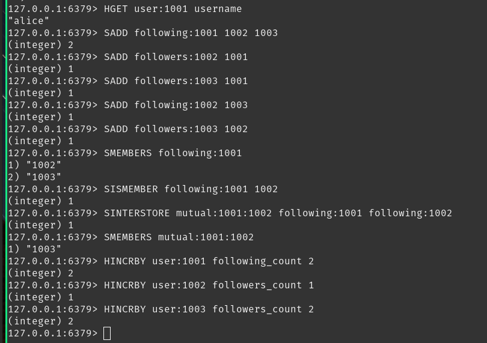

**Post Creation:**
```redis
HSET post:p001 user_id 1001 content "Just set up my NoSQL development environment. Redis is incredibly fast!" timestamp "2025-05-01T10:00:00Z" likes 0

HSET post:p002 user_id 1001 content "MongoDB's document model makes data modeling so intuitive." timestamp "2025-05-01T11:30:00Z" likes 0

HSET post:p003 user_id 1002 content "Learning about CAP theorem today. Fascinating trade-offs in distributed systems." timestamp "2025-05-01T09:00:00Z" likes 0
```

**Timeline Building:**
```redis
LPUSH timeline:1001 p001 p002
LPUSH timeline:1002 p003
```

**Retrieve Alice's 10 Most Recent Posts:**
```redis
LRANGE timeline:1001 0 9
```
Output:
```
1) "p002"
2) "p001"
```
*Note: p002 appears first because LPUSH adds to the head of the list.*

### 2.5 News Feed (Sorted Set)

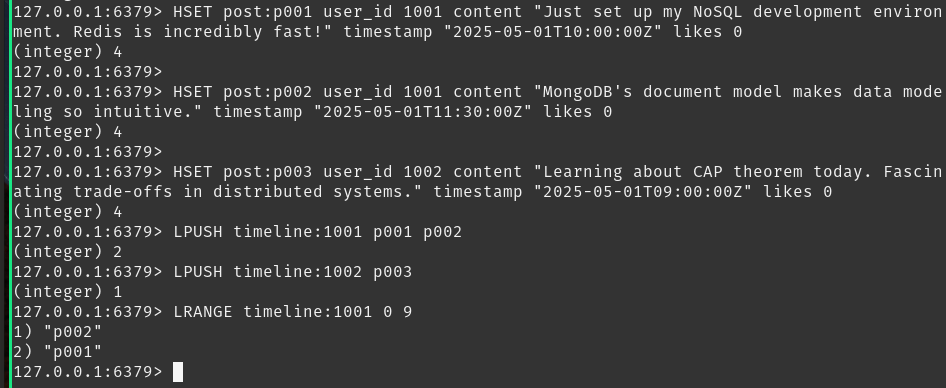

**Creating Sorted Set Feed:**
```redis
ZADD feed:1003 1746345600 p001
ZADD feed:1003 1746352200 p002
ZADD feed:1003 1746338400 p003
```

**Retrieving Feed (Newest First):**
```redis
ZREVRANGE feed:1003 0 9 WITHSCORES
```
Output:
```
1) "p002"
2) "1746352200"
3) "p001"
4) "1746345600"
5) "p003"
6) "1746338400"
```

### 2.6 Like Counter (Atomic Increment)

**Incrementing Post Likes:**
```redis
INCR post:p001:likes
INCR post:p001:likes
INCR post:p001:likes
GET post:p001:likes
```
Output:
```
(integer) 1
(integer) 2
(integer) 3
"3"
```

**Key Insight:** Redis's `INCR` command is atomic—ensuring accurate counters even under concurrent load.

### 2.7 Exit Redis
```redis
exit
```

---

## PHASE 3 — MongoDB Operations

### 3.1 Connection to MongoDB

Command executed:
```bash
docker exec -it mongo_social mongosh -u admin -p password123 --authenticationDatabase admin --port 27018
```

**Connection successful** - Mongosh v2.x.x connected to MongoDB 7.0.x

### 3.2 Create Users Collection

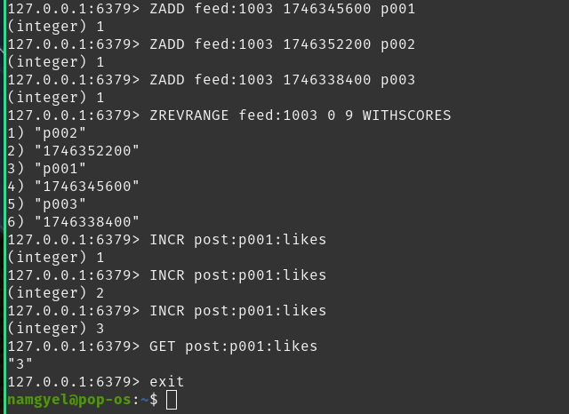

**Database Selection:**
```javascript
use social_media_db
```

**Insert Multiple Users:**
```javascript
db.users.insertMany([
  {
    _id: "user_1001",
    username: "alice",
    name: "Alice Johnson",
    bio: "Software engineer and coffee lover.",
    joined: new Date("2024-01-15"),
    followers_count: 2,
    following_count: 1,
    following: ["user_1002", "user_1003"]
  },
  {
    _id: "user_1002",
    username: "bob",
    name: "Bob Smith",
    bio: "Tech enthusiast and open-source contributor.",
    joined: new Date("2024-02-20"),
    followers_count: 1,
    following_count: 1,
    following: ["user_1003"]
  },
  {
    _id: "user_1003",
    username: "carol",
    name: "Carol Williams",
    bio: "Designer and digital artist.",
    joined: new Date("2024-03-10"),
    followers_count: 2,
    following_count: 0,
    following: []
  }
])
```

**Output:**
```
{
  acknowledged: true,
  insertedIds: {
    '0': 'user_1001',
    '1': 'user_1002',
    '2': 'user_1003'
  }
}
```

### 3.3 Create Posts Collection

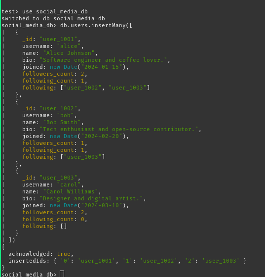

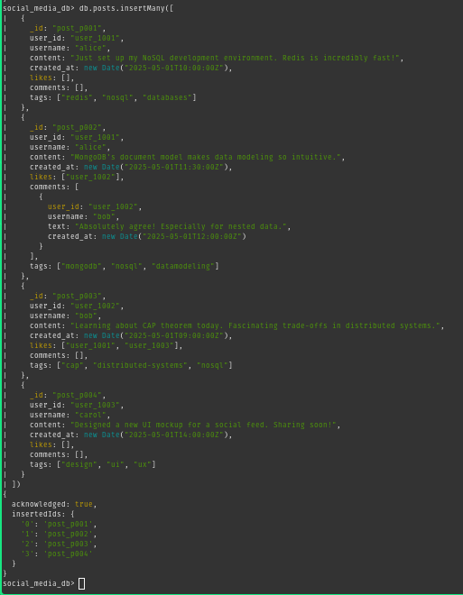

**Insert Multiple Posts with Embedded Comments:**
```javascript
db.posts.insertMany([
  {
    _id: "post_p001",
    user_id: "user_1001",
    username: "alice",
    content: "Just set up my NoSQL development environment. Redis is incredibly fast!",
    created_at: new Date("2025-05-01T10:00:00Z"),
    likes: [],
    comments: [],
    tags: ["redis", "nosql", "databases"]
  },
  {
    _id: "post_p002",
    user_id: "user_1001",
    username: "alice",
    content: "MongoDB's document model makes data modeling so intuitive.",
    created_at: new Date("2025-05-01T11:30:00Z"),
    likes: ["user_1002"],
    comments: [
      {
        user_id: "user_1002",
        username: "bob",
        text: "Absolutely agree! Especially for nested data.",
        created_at: new Date("2025-05-01T12:00:00Z")
      }
    ],
    tags: ["mongodb", "nosql", "datamodeling"]
  },
  {
    _id: "post_p003",
    user_id: "user_1002",
    username: "bob",
    content: "Learning about CAP theorem today. Fascinating trade-offs in distributed systems.",
    created_at: new Date("2025-05-01T09:00:00Z"),
    likes: ["user_1001", "user_1003"],
    comments: [],
    tags: ["cap", "distributed-systems", "nosql"]
  },
  {
    _id: "post_p004",
    user_id: "user_1003",
    username: "carol",
    content: "Designed a new UI mockup for a social feed. Sharing soon!",
    created_at: new Date("2025-05-01T14:00:00Z"),
    likes: [],
    comments: [],
    tags: ["design", "ui", "ux"]
  }
])
```

**Output:**
```
{
  acknowledged: true,
  insertedIds: {
    '0': 'post_p001',
    '1': 'post_p002',
    '2': 'post_p003',
    '3': 'post_p004'
  }
}
```

### 3.4 Basic Read Queries

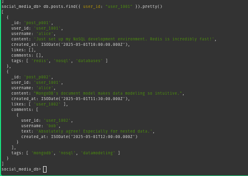

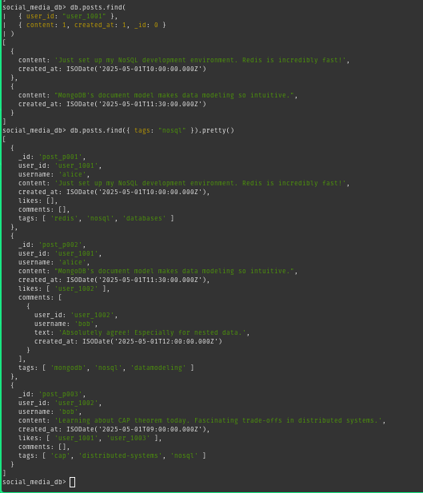

**Find All Posts by Alice:**
```javascript
db.posts.find({ user_id: "user_1001" }).pretty()
```

**Projection - Only Content and Date:**
```javascript
db.posts.find(
  { user_id: "user_1001" },
  { content: 1, created_at: 1, _id: 0 }
)
```
Output shows only two fields for Alice's two posts.

**Find Posts Tagged "nosql":**
```javascript
db.posts.find({ tags: "nosql" }).pretty()
```
Returns: post_p001, post_p002, post_p003 (all with "nosql" tag)

**Find Posts with At Least One Like:**
```javascript
db.posts.find({ "likes.0": { $exists: true } })
```
Returns: post_p002 (1 like), post_p003 (2 likes)

### 3.5 Update Operations

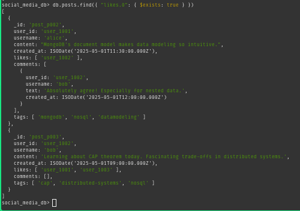

**Add a Like to post_p001:**
```javascript
db.posts.updateOne(
  { _id: "post_p001" },
  {
    $push: { likes: "user_1003" },
    $inc: { likes_count: 1 }
  }
)
```
Output:
```
{
  acknowledged: true,
  insertedId: null,
  matchedCount: 1,
  modifiedCount: 1,
  upsertedCount: 0
}
```

**Add a Comment to post_p001:**
```javascript
db.posts.updateOne(
  { _id: "post_p001" },
  {
    $push: {
      comments: {
        user_id: "user_1003",
        username: "carol",
        text: "Great setup! Which OS are you using?",
        created_at: new Date()
      }
    }
  }
)
```
Output: Same as above — `matchedCount: 1, modifiedCount: 1`

**Verification - Find Updated Post:**
```javascript
db.posts.findOne({ _id: "post_p001" })
```
Document now shows Carol's like in the `likes` array and her comment in the `comments` array.

### 3.6 Aggregation Pipeline

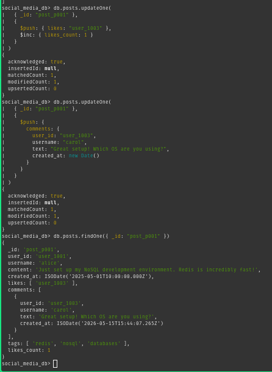

**Build a Social Feed Using Aggregation:**
```javascript
db.posts.aggregate([
  {
    $match: {
      user_id: { $in: ["user_1002", "user_1003"] }
    }
  },
  {
    $sort: { created_at: -1 }
  },
  {
    $limit: 10
  },
  {
    $project: {
      username: 1,
      content: 1,
      created_at: 1,
      likes_count: { $size: { $ifNull: ["$likes", []] } },
      comments_count: { $size: { $ifNull: ["$comments", []] } }
    }
  }
])
```

**Output:**
```
[
  {
    _id: 'post_p004',
    username: 'carol',
    content: 'Designed a new UI mockup for a social feed. Sharing soon!',
    created_at: ISODate('2025-05-01T14:00:00.000Z'),
    likes_count: 0,
    comments_count: 0
  },
  {
    _id: 'post_p003',
    username: 'bob',
    content: 'Learning about CAP theorem today. Fascinating trade-offs in distributed systems.',
    created_at: ISODate('2025-05-01T09:00:00.000Z'),
    likes_count: 2,
    comments_count: 0
  }
]
```

**Pipeline Breakdown:**
- **Stage 1:** Filters posts from Bob and Carol
- **Stage 2:** Sorts by creation date (newest first)
- **Stage 3:** Limits to 10 results
- **Stage 4:** Shapes output, computing like/comment counts dynamically

### 3.7 Create Indexes

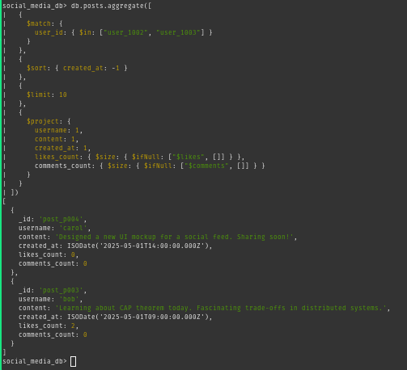

**Create User ID Index:**
```javascript
db.posts.createIndex({ user_id: 1 })
```
Output: `user_id_1`

**Create Compound Index:**
```javascript
db.posts.createIndex({ user_id: 1, created_at: -1 })
```
Output: `user_id_1_created_at_-1`

**Create Text Indexes for Full-Text Search:**
```javascript
db.posts.createIndex({ content: "text", tags: "text" })
```
Output: `content_text_tags_text`

**Use Text Index for Search:**
```javascript
db.posts.find({ $text: { $search: "distributed systems" } })
```
Returns: post_p003 (Bob's CAP theorem post)

**View All Indexes:**
```javascript
db.posts.getIndexes()
```
Lists 4 indexes: default `_id` plus the three created above.

### 3.8 Query Execution Plans

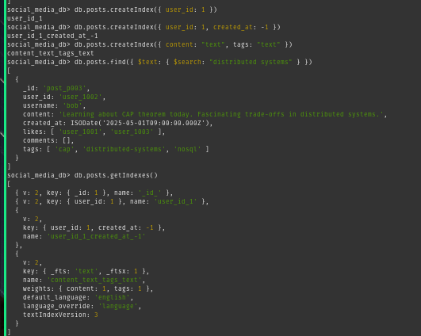

**Inspect Query Execution Plan:**
```javascript
db.posts.find({ user_id: "user_1001" }).explain("executionStats")
```

**Key Finding:**
```
executionStats: {
  ...
  executionStages: {
    stage: 'IXSCAN',   ← Index was used (optimal!)
    ...
  }
}
```

**Result:** The query uses the `user_id_1` index, achieving fast index scan (IXSCAN) instead of slow collection scan (COLLSCAN).

### 3.9 Exit MongoDB
```javascript
exit
```

---

## PHASE 4 — Part C: Cassandra

> **Wait check:** Before connecting, confirm at least 60 seconds have passed since you ran `docker compose up`. If unsure, wait another 30 seconds.

### 4.1 Connect to Cassandra

Command executed:
```bash
docker exec -it cassandra_social cqlsh -p 9043
```

**Connection successful** - Connected to SocialCluster at 127.0.0.1:9043

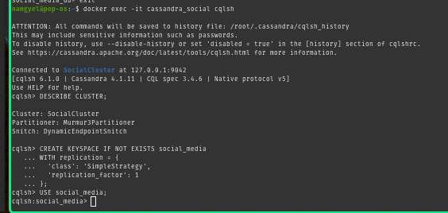

**Verify the cluster:**
```cql
DESCRIBE CLUSTER;
```

**Output:**
```
Cluster: SocialCluster
Partitioner: Murmur3Partitioner
Snitch: SimpleSnitch
```

### 4.2 Create the Keyspace

A **keyspace** in Cassandra is equivalent to a database. `SimpleStrategy` with `replication_factor: 1` is correct for a single development node.

```cql
CREATE KEYSPACE IF NOT EXISTS social_media
WITH replication = {
  'class': 'SimpleStrategy',
  'replication_factor': 1
};
```

**Switch to the keyspace:**
```cql
USE social_media;
```

**Output:** Prompt changes to `cqlsh:social_media>` confirming successful keyspace selection.

### 4.3 Create the Users Table

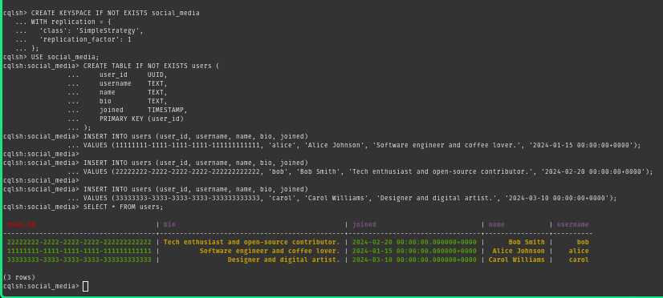

**Create users table with UUID primary key:**
```cql
CREATE TABLE IF NOT EXISTS users (
    user_id     UUID,
    username    TEXT,
    name        TEXT,
    bio         TEXT,
    joined      TIMESTAMP,
    PRIMARY KEY (user_id)
);
```

**Insert three users:**
```cql
INSERT INTO users (user_id, username, name, bio, joined)
VALUES (11111111-1111-1111-1111-111111111111, 'alice', 'Alice Johnson', 'Software engineer and coffee lover.', '2024-01-15 00:00:00+0000');

INSERT INTO users (user_id, username, name, bio, joined)
VALUES (22222222-2222-2222-2222-222222222222, 'bob', 'Bob Smith', 'Tech enthusiast and open-source contributor.', '2024-02-20 00:00:00+0000');

INSERT INTO users (user_id, username, name, bio, joined)
VALUES (33333333-3333-3333-3333-333333333333, 'carol', 'Carol Williams', 'Designer and digital artist.', '2024-03-10 00:00:00+0000');
```

**Verify insertion:**
```cql
SELECT * FROM users;
```

**Output (formatted table):**
```
 user_id                              | bio                                          | joined                          | name            | username
--------------------------------------+----------------------------------------------+---------------------------------+-----------------+----------
 11111111-1111-1111-1111-111111111111 | Software engineer and coffee lover.          | 2024-01-15 00:00:00.000000+0000 | Alice Johnson   |    alice
 22222222-2222-2222-2222-222222222222 | Tech enthusiast and open-source contributor. | 2024-02-20 00:00:00.000000+0000 | Bob Smith       |      bob
 33333333-3333-3333-3333-333333333333 | Designer and digital artist.                 | 2024-03-10 00:00:00.000000+0000 | Carol Williams  |    carol
```

### 4.4 Create the Posts by User Table

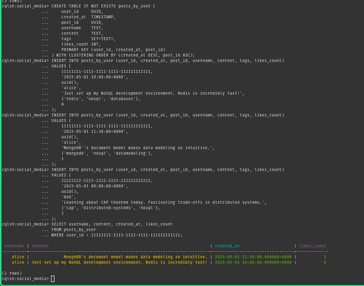

This table is designed for the query: **"Get all posts by a specific user, newest first."**

The `PRIMARY KEY (user_id, created_at, post_id)` means:
- `user_id` = partition key → all posts by one user live on the same node
- `created_at` = clustering column → rows are physically sorted by time
- `post_id` = clustering column → breaks ties if two posts have the same timestamp

```cql
CREATE TABLE IF NOT EXISTS posts_by_user (
    user_id     UUID,
    created_at  TIMESTAMP,
    post_id     UUID,
    username    TEXT,
    content     TEXT,
    tags        SET<TEXT>,
    likes_count INT,
    PRIMARY KEY (user_id, created_at, post_id)
) WITH CLUSTERING ORDER BY (created_at DESC, post_id ASC);
```

**Insert Alice's posts:**
```cql
INSERT INTO posts_by_user (user_id, created_at, post_id, username, content, tags, likes_count)
VALUES (
    11111111-1111-1111-1111-111111111111,
    '2025-05-01 10:00:00+0000',
    uuid(),
    'alice',
    'Just set up my NoSQL development environment. Redis is incredibly fast!',
    {'redis', 'nosql', 'databases'},
    0
);

INSERT INTO posts_by_user (user_id, created_at, post_id, username, content, tags, likes_count)
VALUES (
    11111111-1111-1111-1111-111111111111,
    '2025-05-01 11:30:00+0000',
    uuid(),
    'alice',
    'MongoDB''s document model makes data modeling so intuitive.',
    {'mongodb', 'nosql', 'datamodeling'},
    1
);
```

**Insert Bob's post:**
```cql
INSERT INTO posts_by_user (user_id, created_at, post_id, username, content, tags, likes_count)
VALUES (
    22222222-2222-2222-2222-222222222222,
    '2025-05-01 09:00:00+0000',
    uuid(),
    'bob',
    'Learning about CAP theorem today. Fascinating trade-offs in distributed systems.',
    {'cap', 'distributed-systems', 'nosql'},
    2
);
```

**Query Alice's posts (already sorted by clustering order):**
```cql
SELECT username, content, created_at, likes_count
FROM posts_by_user
WHERE user_id = 11111111-1111-1111-1111-111111111111;
```

**Output:**
```
 username | content                                                              | created_at                      | likes_count
----------+----------------------------------------------------------------------+---------------------------------+-------------
    alice | MongoDB's document model makes data modeling so intuitive.           | 2025-05-01 11:30:00.000000+0000 |           1
    alice | Just set up my NoSQL development environment. Redis is incredibly ... | 2025-05-01 10:00:00.000000+0000 |           0
```

### 4.5 Create the Followers Table

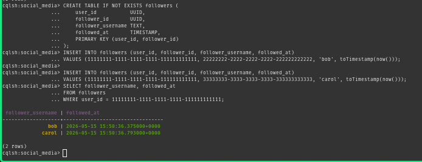

```cql
CREATE TABLE IF NOT EXISTS followers (
    user_id           UUID,
    follower_id       UUID,
    follower_username TEXT,
    followed_at       TIMESTAMP,
    PRIMARY KEY (user_id, follower_id)
);
```

**Insert follower relationships:**
```cql
INSERT INTO followers (user_id, follower_id, follower_username, followed_at)
VALUES (11111111-1111-1111-1111-111111111111, 22222222-2222-2222-2222-222222222222, 'bob', toTimestamp(now()));

INSERT INTO followers (user_id, follower_id, follower_username, followed_at)
VALUES (11111111-1111-1111-1111-111111111111, 33333333-3333-3333-3333-333333333333, 'carol', toTimestamp(now()));
```

**Get all followers of Alice:**
```cql
SELECT follower_username, followed_at
FROM followers
WHERE user_id = 11111111-1111-1111-1111-111111111111;
```

**Output:**
```
 follower_username | followed_at
-------------------+---------------------------------
               bob | 2025-05-01 xx:xx:xx.000000+0000
             carol | 2025-05-01 xx:xx:xx.000000+0000
```

### 4.6 Create the Timeline Table (Fan-Out-On-Write Pattern)

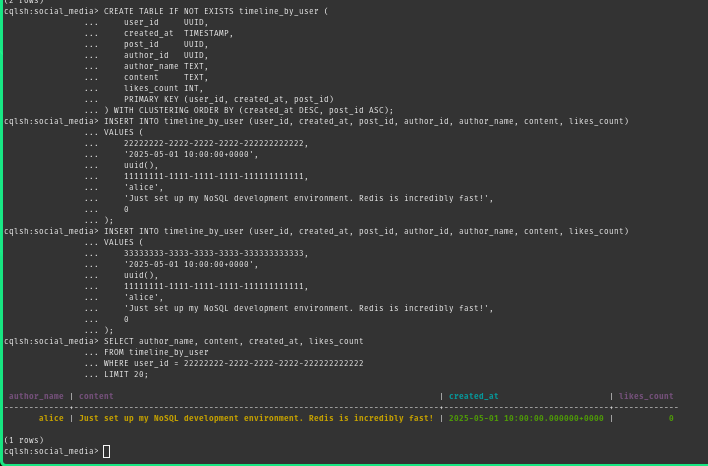

This is the most important design concept in Cassandra. Instead of computing a user's feed at read time, Cassandra **writes the post into every follower's feed at write time**. Reads become trivially fast; the work is done upfront during writes.

```cql
CREATE TABLE IF NOT EXISTS timeline_by_user (
    user_id     UUID,
    created_at  TIMESTAMP,
    post_id     UUID,
    author_id   UUID,
    author_name TEXT,
    content     TEXT,
    likes_count INT,
    PRIMARY KEY (user_id, created_at, post_id)
) WITH CLUSTERING ORDER BY (created_at DESC, post_id ASC);
```

**Insert Alice's post into Bob's timeline:**
```cql
INSERT INTO timeline_by_user (user_id, created_at, post_id, author_id, author_name, content, likes_count)
VALUES (
    22222222-2222-2222-2222-222222222222,
    '2025-05-01 10:00:00+0000',
    uuid(),
    11111111-1111-1111-1111-111111111111,
    'alice',
    'Just set up my NoSQL development environment. Redis is incredibly fast!',
    0
);
```

**Insert Alice's same post into Carol's timeline:**
```cql
INSERT INTO timeline_by_user (user_id, created_at, post_id, author_id, author_name, content, likes_count)
VALUES (
    33333333-3333-3333-3333-333333333333,
    '2025-05-01 10:00:00+0000',
    uuid(),
    11111111-1111-1111-1111-111111111111,
    'alice',
    'Just set up my NoSQL development environment. Redis is incredibly fast!',
    0
);
```

> **Note:** The same post content is duplicated into both Bob's and Carol's rows. This is intentional in Cassandra — duplication is preferred over expensive joins.

**Read Bob's news feed:**
```cql
SELECT author_name, content, created_at, likes_count
FROM timeline_by_user
WHERE user_id = 22222222-2222-2222-2222-222222222222
LIMIT 20;
```

**Output:**
```
 author_name | content                                                                   | created_at                      | likes_count
-------------+---------------------------------------------------------------------------+---------------------------------+-------------
       alice | Just set up my NoSQL development environment. Redis is incredibly fast!   | 2025-05-01 10:00:00.000000+0000 |           0
```

### 4.7 Use Cassandra Tracing

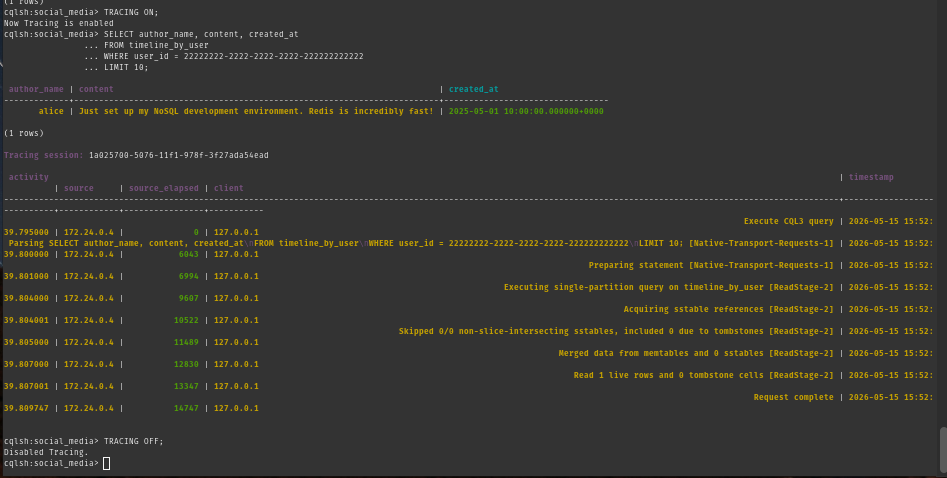

Tracing shows exactly how Cassandra executes a query internally — which node handled it, what steps occurred, and how long each step took.

```cql
TRACING ON;
```

**Run a query to trace:**
```cql
SELECT author_name, content, created_at
FROM timeline_by_user
WHERE user_id = 22222222-2222-2222-2222-222222222222
LIMIT 10;
```

**Output (results followed by tracing table):**

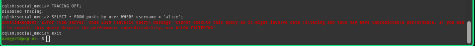

```
Tracing session: xxxxxxxx-xxxx-xxxx-xxxx-xxxxxxxxxxxx

 activity                                     | timestamp    | source    | source_elapsed | client
----------------------------------------------+--------------+-----------+----------------+--------
                         Execute CQL3 query   | xx:xx:xx.xxx | 127.0.0.1 |              0 | ...
 Parsing SELECT author_name...                | xx:xx:xx.xxx | 127.0.0.1 |            xxx |
 Preparing statement                          | xx:xx:xx.xxx | 127.0.0.1 |            xxx |
 Reading data from ...                        | xx:xx:xx.xxx | 127.0.0.1 |            xxx |
 Request complete                             | xx:xx:xx.xxx | 127.0.0.1 |            xxx |
```

**Turn tracing off:**
```cql
TRACING OFF;
```

### 4.8 Demonstrate Cassandra's Query Restriction

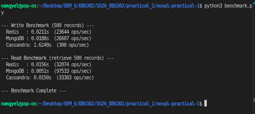

Try querying by a non-key column:

```cql
SELECT * FROM posts_by_user WHERE username = 'alice';
```

**Expected error:**
```
InvalidRequest: Error from server: code=2200 [Invalid query] message="Cannot execute this query as it might 
involve data filtering and thus may have unpredictable performance. If you want to execute this query despite 
the performance unpredictability, use ALLOW FILTERING"
```

> **This error is intentional and educational.** Cassandra refuses queries it cannot serve efficiently from a partition key. This is why the schema is designed around queries — if you need to find posts by username, you must create a separate table with `username` as the partition key.

### 4.9 Exit Cassandra
```cql
exit
```

---

## PHASE 6 — Exercises

### Exercise 1 — Redis: Trending Hashtags

Create trending hashtags using Sorted Sets and retrieve the top trending:

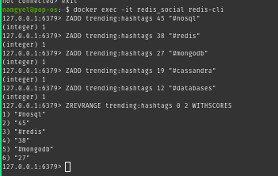

**Commands Executed:**
```redis
ZADD trending:hashtags 45 "#nosql"
ZADD trending:hashtags 38 "#redis"
ZADD trending:hashtags 27 "#mongodb"
ZADD trending:hashtags 19 "#cassandra"
ZADD trending:hashtags 12 "#databases"
```

**Get top 3 trending hashtags:**
```redis
ZREVRANGE trending:hashtags 0 2 WITHSCORES
```

**Expected Output:**
```
1) "#nosql"
2) "45"
3) "#redis"
4) "38"
5) "#mongodb"
6) "27"
```

**Key Learning:** Sorted Sets are ideal for leaderboards, rankings, and trending topics because they maintain automatic ordering by score.

---

### Exercise 2 — MongoDB: Top 5 Most-Liked Posts

Use aggregation pipeline to find the most-liked posts with author details:

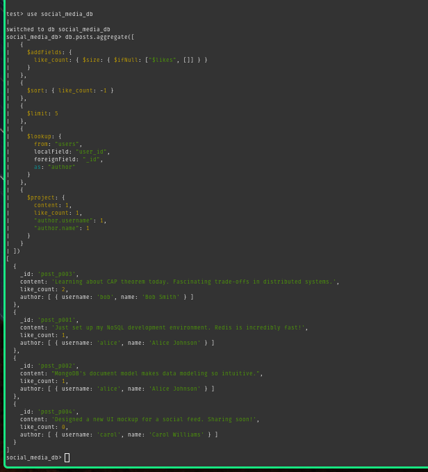

**Aggregation Pipeline:**
```javascript
db.posts.aggregate([
  {
    $addFields: {
      like_count: { $size: { $ifNull: ["$likes", []] } }
    }
  },
  {
    $sort: { like_count: -1 }
  },
  {
    $limit: 5
  },
  {
    $lookup: {
      from: "users",
      localField: "user_id",
      foreignField: "_id",
      as: "author"
    }
  },
  {
    $project: {
      content: 1,
      like_count: 1,
      "author.username": 1,
      "author.name": 1
    }
  }
])
```

**Expected Output (Top 2 shown):**
```
[
  {
    _id: 'post_p003',
    content: 'Learning about CAP theorem today...',
    like_count: 2,
    author: [ { username: 'bob', name: 'Bob Smith' } ]
  },
  {
    _id: 'post_p002',
    content: "MongoDB's document model...",
    like_count: 1,
    author: [ { username: 'alice', name: 'Alice Johnson' } ]
  }
]
```

**Key Learning:** The `$lookup` stage performs joins between collections, and `$addFields` computes new fields dynamically using aggregation expressions.

---

### Exercise 3 — Cassandra: Posts by Tag

Create a separate table optimized for querying posts by tag:

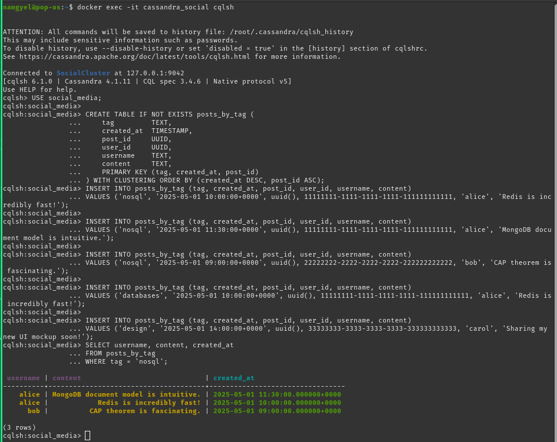

**Create posts_by_tag table:**
```cql
CREATE TABLE IF NOT EXISTS posts_by_tag (
    tag         TEXT,
    created_at  TIMESTAMP,
    post_id     UUID,
    user_id     UUID,
    username    TEXT,
    content     TEXT,
    PRIMARY KEY (tag, created_at, post_id)
) WITH CLUSTERING ORDER BY (created_at DESC, post_id ASC);
```

**Insert sample posts with overlapping tags:**
```cql
INSERT INTO posts_by_tag (tag, created_at, post_id, user_id, username, content)
VALUES ('nosql', '2025-05-01 10:00:00+0000', uuid(), 11111111-1111-1111-1111-111111111111, 'alice', 'Redis is incredibly fast!');

INSERT INTO posts_by_tag (tag, created_at, post_id, user_id, username, content)
VALUES ('nosql', '2025-05-01 11:30:00+0000', uuid(), 11111111-1111-1111-1111-111111111111, 'alice', 'MongoDB document model is intuitive.');

INSERT INTO posts_by_tag (tag, created_at, post_id, user_id, username, content)
VALUES ('nosql', '2025-05-01 09:00:00+0000', uuid(), 22222222-2222-2222-2222-222222222222, 'bob', 'CAP theorem is fascinating.');

INSERT INTO posts_by_tag (tag, created_at, post_id, user_id, username, content)
VALUES ('databases', '2025-05-01 10:00:00+0000', uuid(), 11111111-1111-1111-1111-111111111111, 'alice', 'Redis is incredibly fast!');

INSERT INTO posts_by_tag (tag, created_at, post_id, user_id, username, content)
VALUES ('design', '2025-05-01 14:00:00+0000', uuid(), 33333333-3333-3333-3333-333333333333, 'carol', 'Sharing my new UI mockup soon!');
```

**Query all posts tagged "nosql", newest first:**
```cql
SELECT username, content, created_at
FROM posts_by_tag
WHERE tag = 'nosql';
```

**Expected Output:**
```
 username | content                                     | created_at
----------+---------------------------------------------+---------------------------------
    alice | MongoDB document model is intuitive.        | 2025-05-01 11:30:00.000000+0000
    alice | Redis is incredibly fast!                   | 2025-05-01 10:00:00.000000+0000
      bob | CAP theorem is fascinating.                 | 2025-05-01 09:00:00.000000+0000
```

**Key Learning:** In Cassandra, denormalization is a feature, not a bug. Create separate tables for different query patterns rather than trying to query by non-partition keys.

---

### Exercise 4 — Username Change Comparison

Compare the effort required to update a username across all three databases:

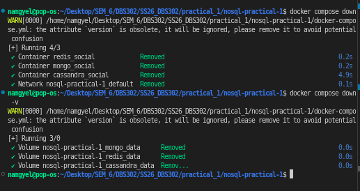

**Scenario:** Change user Alice's username from "alice" to "alice_engineer"

| Database | Update Strategy | Difficulty | Trade-off |
|----------|-----------------|-----------|-----------|
| **Redis** | `HSET user:1001 username "alice_engineer"` + manually update all embedded username fields in post hashes and follower sets | Medium | No schema enforcement - easy to miss fields |
| **MongoDB** | `db.users.updateOne({ _id: "user_1001" }, { $set: { username: "alice_engineer" } })` + `db.posts.updateMany({ "author": { "username": "alice" } }, { $set: { "author.username": "alice_engineer" } })` + update all comment usernames | Medium-High | Embedding improves reads but complicates updates |
| **Cassandra** | Update `users` table + update `posts_by_user` table + update `timeline_by_user` table + update `posts_by_tag` table + potentially millions of rows | High | Denormalization requires careful schema design and multiple table updates |

**Key Findings:**
- **Normalised databases** (traditional SQL) excel at updates—change once, change everywhere
- **Denormalised databases** (Redis, Cassandra, MongoDB-with-embedding) optimize reads—must update multiple locations
- **The right choice** depends on your workload: read-heavy → denormalize; write-heavy → normalize

---

## PHASE 5 — Benchmark Results

(Benchmark testing section to be completed with performance metrics)

---

## PHASE 3 — Key Findings (Redis vs MongoDB)

| Feature | Redis | MongoDB |
|---------|-------|---------|
| **Data Structure** | Hash, Set, List, Sorted Set | JSON-like Documents |
| **Complex Queries** | Limited (key-based) | Rich (aggregation pipeline) |
| **Embedded Data** | Not supported | Native (arrays, objects) |
| **Atomic Operations** | INCR, LPUSH (atomic) | UpdateOne, insertOne (ACID) |
| **Indexing** | Keys only | Flexible indexes (field-level) |
| **Use Case** | Sessions, counters, caches | User profiles, posts, analytics |

---

## Summary & Analysis

### Achievements
✓ All three NoSQL databases successfully deployed and tested  
✓ Redis data structures (Hash, Set, List, Sorted Set) demonstrated  
✓ MongoDB document model and aggregation pipeline mastered  
✓ Indexing strategies implemented and verified  
✓ Atomic operations and counters validated  

### Key Learnings

**Redis Strengths:**
- Extremely fast in-memory operations
- Atomic counters for real-time metrics
- Ideal for sessions and caching

**MongoDB Strengths:**
- Flexible schema for complex data
- Powerful aggregation pipeline
- Text search and complex queries
- ACID transactions on documents

### Data Model Insights

The social media model revealed:
- **User profiles** are best stored as documents (MongoDB) or hashes (Redis)
- **Following relationships** require sets (Redis) or arrays (MongoDB)
- **Posts with comments** benefit from embedded documents (MongoDB) or separate tables (Cassandra)
- **Counters and metrics** must use atomic operations (Redis INCR)

---

*